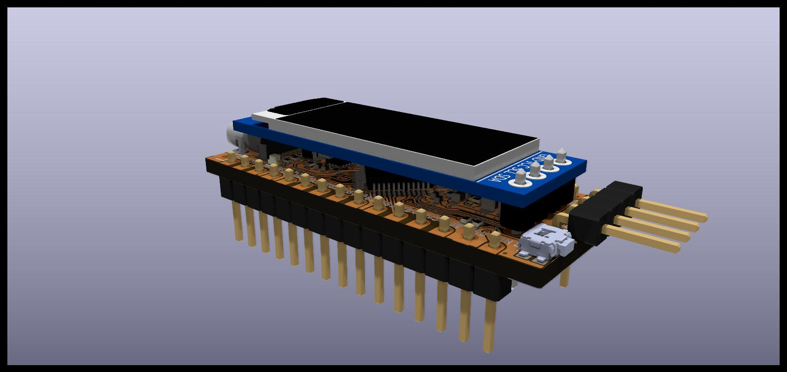
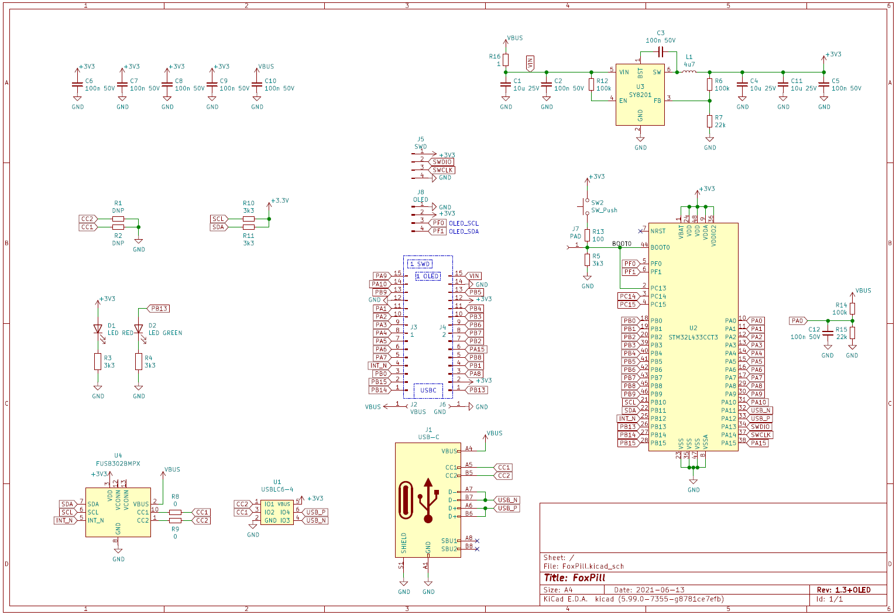
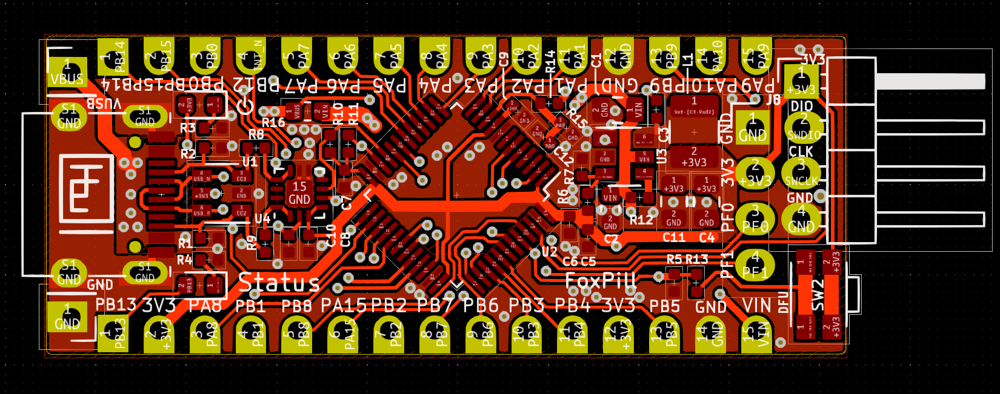

# FoxPill

an STM32L433-based, MicroPython-capable board in Arduino Nano-like form factor which adds a 128x32 px OLED display.

### Schematic

[schematic pdf](FoxPill/pdf/FoxPill-1.3_OLED_schematic.pdf)

### Board

See also

* [gerber files](FoxPill/gerber/)
* [layout pdf overview](FoxPill/pdf/FoxPill-1.3_OLED_layout.pdf)

### OtterPill

The board is derived from [OtterPill](https://github.com/Jan--Henrik/OtterPill) and backwards compatible.

